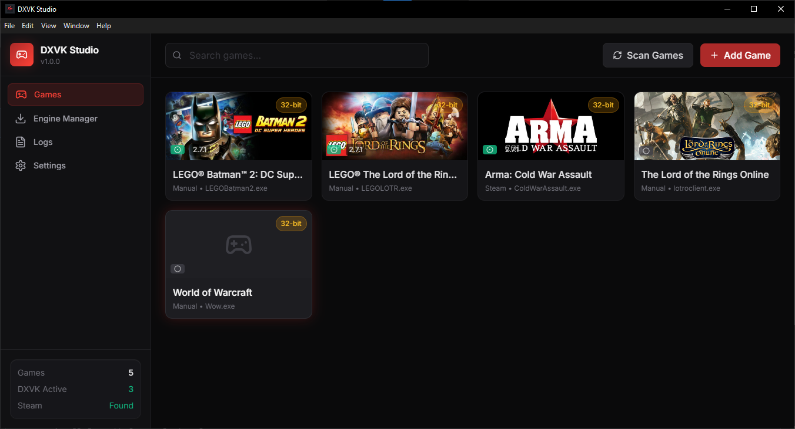

<div align="center">


# DXVK Studio

A Windows desktop app that makes [DXVK](https://github.com/doitsujin/dxvk) easy for everyone.

[](https://github.com/Zendevve/dxvk-studio/releases)
[](https://github.com/Zendevve/dxvk-studio/releases)
[](LICENSE)
[](https://electronjs.org)

<br>



</div>

---

## What does it do?

DXVK is a translation layer that converts DirectX calls to Vulkan. It can **boost FPS in older games** and fix compatibility issues on modern systems. The problem? Installing it manually is tedious—downloading archives, picking the right DLLs, editing config files.

**DXVK Studio automates all of that.** Point it at your games, pick a version, click install. Done.

---

## Features

- **Auto-detects your games** from Steam, GOG Galaxy, and Epic Games Store
- **Handles 32-bit and 64-bit** automatically by reading executable headers
- **Multiple DXVK forks** — Official, GPL Async (shader stutter fix), and NVAPI
- **Safe installs** — backs up original DLLs before any changes
- **Visual config editor** — tweak HUD, VSync, FPS limits without touching files
- **Anti-cheat warnings** — alerts you before modifying online games
- **Activity logs** — see everything the app has done

---

## Quick Start

**Download:** Grab the latest installer from [Releases](https://github.com/Zendevve/dxvk-studio/releases)

**Requirements:** Windows 10/11, Vulkan-capable GPU

**Usage:**
1. Launch the app — your games appear automatically
2. Click a game → choose fork and version → click **Install**
3. To undo, click **Uninstall** — original files are restored

---

## For Developers

### Tech Stack

| Layer | Technology |
|-------|------------|
| Framework | Electron 33 |
| UI | React 18 + TypeScript |
| Styling | TailwindCSS |
| Build | Vite + electron-builder |
| Testing | Vitest |

### Architecture

```
electron/
├── main.ts              # App entry, IPC handlers
├── preload.ts           # Context bridge (security)
└── services/
    ├── steam-scanner.ts # VDF parsing, registry queries
    ├── gog-scanner.ts   # GOG Galaxy registry integration
    ├── epic-scanner.ts  # Epic manifest parsing
    ├── pe-analyzer.ts   # PE header reading (32/64-bit detection)
    ├── engine-manager.ts# GitHub/GitLab API, download, cache
    ├── deployer.ts      # DLL installation, backup, restore
    └── anti-cheat.ts    # Signature detection

src/
├── App.tsx              # Main UI controller
├── components/          # Reusable React components
└── shared/types.ts      # Shared TypeScript interfaces
```

### Development

```bash
git clone https://github.com/Zendevve/dxvk-studio.git
cd dxvk-studio
npm install
npm run dev      # Start with hot reload
npm test         # Run tests
npm run build    # Production build
```

### Key Design Decisions

- **Windows-first**: Registry queries, PE parsing, native paths — built for Windows from day one
- **Offline-capable**: Downloaded engines are cached locally
- **Non-destructive**: Every install creates backups; uninstall always works
- **No admin required**: Operates entirely in user space

---

## Roadmap

| Status | Feature |
|--------|---------|
| ✅ | Multi-launcher game detection |
| ✅ | One-click DXVK install/uninstall |
| ✅ | Config editor with visual UI |
| ✅ | Anti-cheat detection |
| 🔜 | Per-game configuration profiles |
| 🔜 | HUD position/scale editor |
| 📋 | Profile import/export |
| 📋 | Linux support |

---

## Contributing

Pull requests welcome. For significant changes, open an issue first.

See [CHANGELOG.md](CHANGELOG.md) for version history.

---

## License

[MIT](LICENSE) — use it however you want.

---

<div align="center">

Made by [Zendevve](https://github.com/Zendevve)

</div>
